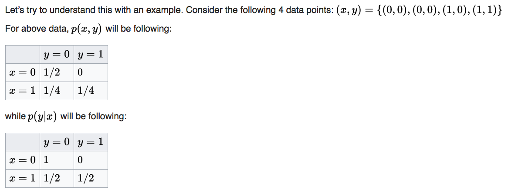

autoscale: true

## you've been doing statistics all along

---

## ML is:

---
| dogs    | cats     | turtles  |
|---------|----------|----------|
| 3       | 4        | 3        |
| 1       | 9        | 6        |
| 2       | 2        | 7        |
| 5       | 1        | 2        |
| 3       | 3        | 1        |
| 6       | 5        | 4        |
| 4       | 8        | 9        |
| 7       | 1        | 4        |

---

```python
X = df[['dogs', 'cats']]
y = df['turtles']

ŷ = model.predict(X)
```
---

## so, how do we do this?

---

```python
import sklearn
```

---

This presentation starts and ends here.

Your head is currently above water; we're going to dive into the pool, touch the bottom, then come back to the surface.

---

## linear regression

---

`y = weights^T * x`

<br>

$$
\hat{y} = \theta^Tx
$$

---
$$\hat{y}$$ is computed as a function of both $$x$$ and $$\theta$$. We'd like this value to be close to the true $$y$$.

$$\mathcal{L} = \sum\limits_{i=1}^m (\theta^Tx^{(i)} - y^{(i)})^2$$

---

For clarity, now in semi-obnoxious Python:

<br>

```python
error = guess - true
loss = (error**2).sum()
```

---
> I do machine learning; I should probably learn statistics, though, too?

-- me at some point; hopefully none of you

---

* `df['dogs']` is a "random variable." It doesn't depend on anything.

* `df['cats']` is a "random variable." It doesn't depend on anything.

--

* `df['turtles']` is a "random variable." It depends on `df['dogs']` and `df['cats']`.

---

Goal: change `weights` so as to minimize our error function.

---

## probability distributions

---

This is a probability distribution. It is a lookup table for the likelihood of observing each unique outcome of a random variable.

```python
cats = {2: .17, 5: .24, 3: .11, 9: .48}
```
--

Trivially, the values should sum to 1.

---

Typically, probability distributions take parameters which control their shape. Let's define a function to illustrate this:

```python
def prob_distribution_cats(λ):
    return distribution

In [1]: prob_distribution_cats(λ=5)
Out[1]: {2: .37, 5: .14, 3: .13, 9: .36}

In [2]: prob_distribution_cats(λ=84)
Out[2]: {2: .09, 5: .32, 3: .17, 9: .42}
```

---

The realized values of a random variable are dictated by its probability distribution.

--

* What probability distributions dictate the values of our random variables?

---

Let's start by writing our data as draws from a distribution.

$$
P(\theta), P(X), P(y\vert X, \theta)
$$

---

Which probability distributions describe our data? Let's start with $$y$$ and assume it is distributed *normally*, i.e.

$$
y \sim \mathcal{N}(\mu, \sigma^2)
$$

where $$\mathcal{N}$$ gives the normal distribution.

---

Naturally, will assume that $$\mu = \theta^Tx$$, where $$\sigma$$ describes some irreducible error in our estimate of $$y$$.

Irreducible error means: $$y$$ really depends on some other input - e.g. `df['zebras']` - that we haven't included in our model.

---

## likelihood functions

---

The values of $$y$$ are distributed as $$y \sim \mathcal{N}(\theta^Tx, \sigma^2)$$.

The probability of drawing a specific value of $$y^{(i)}$$ given $$x^{(i)}$$ and $$\theta$$ is given by the normal likelihood function.

---

$$
P(y^{(i)}\vert x^{(i)}; \theta) = \frac{1}{\sqrt{2\pi}\sigma}\exp{\bigg(-\frac{(y^{(i)} - \theta^Tx^{(i)})^2}{2\sigma^2}\bigg)}
$$

-- Carl Friedrich Gauss, 1809

---

* Goal: change `weights` so as to minimize our error function.

_**Which should we choose?**_

---

## maximum likelihood estimation

---

A Moroccan walks into a bar. He's wearing a football jersey that's missing a sleeve. He has a black eye, and blood on his jeans. How did he most likely spend his day?

---

1. At home, reading a book.
2. Training for a bicycle race.
3. At the WAC vs. Raja game drinking Casablanca beers with his friends - all of whom are MMA fighters and despise the other team.

---

_**Which `weights` maximize the likelihood of having observed the $$y$$ that we did?**_

---

This is called the **maximum likelihood estimate**. To compute it, we simply pick the `weights` that maximize $$P(y^{(i)}\vert x^{(i)}; \theta)$$ from above. However, we're not just concerned about one outcome $$y^{(i)}$$; instead, we care about them all.

---

Assuming that $$y^{(i)}$$ values are independent of one another, we can write their *joint* likelihood as follows:

$$
P(y\vert x; \theta) = \prod\limits_{i=1}^{m}P(y^{(i)}\vert x^{(i)}; \theta)
$$

_**There is nothing scary about this product**_; whereas the lone term gives the likelihood of one data point, the product gives the likelihood of having observed all data points. This is akin to:

```python
die = choose_from([1, 2, 3, 4, 5, 6])
P(die > 2, die < 4, die == 1) = 4/6 * 3/6 * 1/6
```

---

Since probabilities are numbers in $$[0, 1]$$, the product of a bunch of probabilities gets very small, very quick. For this reason, we often take the natural logarithm.

$$
\begin{align*}
\log{P(y\vert x; \theta)}
&= \log{\prod\limits_{i=1}^{m}P(y^{(i)}\vert x^{(i)}; \theta)}\\
&= \sum\limits_{i=1}^{m}\log{P(y^{(i)}\vert x^{(i)}; \theta)}\\
&= \sum\limits_{i=1}^{m}\log{\frac{1}{\sqrt{2\pi}\sigma}\exp{\bigg(-\frac{(y^{(i)} - \theta^Tx^{(i)})^2}{2\sigma^2}\bigg)}}\\
&= \sum\limits_{i=1}^{m}\log{\frac{1}{\sqrt{2\pi}\sigma}} + \sum\limits_{i=1}^{m}\log{\exp{\bigg(-\frac{(y^{(i)} - \theta^Tx^{(i)})^2}{2\sigma^2}\bigg)}}\\
&= m\log{\frac{1}{\sqrt{2\pi}\sigma}} - \frac{1}{2\sigma^2}\sum\limits_{i=1}^{m}(y^{(i)} - \theta^Tx^{(i)})^2\\
&= C_1 - C_2\sum\limits_{i=1}^{m}(y^{(i)} - \theta^Tx^{(i)})^2\\
\end{align*}
$$

_**Maximizing the log-likelihood of our data with respect to $$\theta$$, i.e. `weights`, is equivalent to maximizing the negative mean squared error between $$y$$ and $$\hat{y}$$.**_

---

Most optimization routines minimize.

_**Minimizing the log-likelihood of our data with respect to $$\theta$$, i.e. `weights`, is equivalent to minimizing the mean squared error between $$y$$ and $$\hat{y}$$.**_

---

## logistic regression

---

$$
p = \frac{1}{1 + e^{-\theta^Tx}}
$$

$$
\mathcal{L} = -\sum\limits_{i = 1}^m y^{(i)}\log{p^{(i)}} + (1 - y^{(i)})\log{(1 - p^{(i)})}
$$

---

$$y$$ is a binary random variable: it is a thing that takes values in $$\{0, 1\}$$.

---


---

$$
P(y\vert x; \theta) = \prod\limits_{i = 1}^m(p^{(i)})^{y^{(i)}}(1 - p^{(i)})^{1 - y^{(i)}}
$$

**If this looks confusing:**

* Disregard the left side
* Ask yourself: what is the probability of observing the following specific sequence of coin flips, where $$P(\text{heads}) = .7$$:

$$
\begin{align*}
P(\text{heads}, \text{tails}, \text{heads}, \text{heads})
&= (.7^1 * .3^0)(.7^0 * .3^1)(.7^1 * .3^0)(.7^1 * .3^0)\\
&= .7 * .3 * .7 * .7\\
&= .102899
\end{align*}
$$

---

Negative log-likelihood:

$$
\begin{align*}
-\log{P(y\vert x; \theta)}
&= -\log{\prod\limits_{i = 1}^m(p^{(i)})^{y^{(i)}}(1 - p^{(i)})^{1 - y^{(i)}}}\\
&= -\sum\limits_{i = 1}^m\log{\bigg((p^{(i)})^{y^{(i)}}(1 - p^{(i)})^{1 - y^{(i)}}\bigg)}\\
&= -\sum\limits_{i = 1}^m\log{(p^{(i)})^{y^{(i)}} + \log{(1 - p^{(i)})^{1 - y^{(i)}}}}\\
&= -\sum\limits_{i = 1}^my^{(i)}\log{(p^{(i)})} + (1 - y^{(i)})\log{(1 - p^{(i)})}\\
\end{align*}
$$

This will look familiar as well.

---

> Remember that using Bayes' theorem doesn't make you a Bayesian. Quantifying uncertainty with probability makes you a Bayesian.

-- Michael Betancourt‏ [(@betanalpha)](https://twitter.com/betanalpha)

---

$$
P(y \vert X) = \frac{P(X\vert y)P(y)}{P(X)} = \frac{P(X, y)}{P(X)}
$$

---

## classification

---

| dogs    | cats     | headache |
|---------|----------|----------|
| 3       | 4        | high     |
| 1       | 9        | high     |
| 2       | 2        | low      |
| 5       | 1        | medium   |
| 3       | 3        | low      |
| 6       | 5        | high     |
| 4       | 8        | low      |
| 7       | 1        | medium   |

---

_**Discriminative models jump directly to estimating $$P(y \vert X)$$ without computing $$P(X\vert y), P(y)$$ and $$P(X)$$.**_

--

In effect, they can distinguish Darija from French, but can't speak either.

---

_**Generative models compute $$P(X\vert y), P(y)$$ and $$P(X)$$, then estimate $$P(y \vert X)$$ via Bayes' theorem.**_

--

Generative models speak fluent Darija and French. They can distinguish the two because duh, they speak each one and know their differences.

---

## generative models

---

## the joint distribution

Generative models start by modeling the *joint distribution* of our data, i.e. $$P(X, y) = P(X\vert y)P(y)$$.




---

# Naive Bayes

$$
P_{\theta}(x, y) = P_{\theta}(x\vert y)P_{\theta}(y) = P_{\theta}(y)\prod\limits_{i=1}^m P_{\theta}(x_i\vert y)
$$

- Estimate $$\hat{\theta}$$ as before
- To make a prediction:

```python
np.argmax([P(x, y) for y in ['low', 'medium', 'high']])
```

---

Finally, to *generate* likely data given a class,

1. Draw a class from $$P(y)$$
2. Draw data from $$P(x, y)$$

---

> What I cannot create, I do not understand.

-- Richard Feynman

---

## discriminative models

---

Define 3 separate models. Do the same linear combination. Biggest number wins.

$$
\hat{y}_{\text{low}} = \theta_{\text{low}}^Tx
$$
<br>
$$
\hat{y}_{\text{medium}} = \theta_{\text{medium}}^Tx
$$
<br>
$$
\hat{y}_{\text{high}} = \theta_{\text{high}}^Tx
$$

* These are *proportional* to the joint distribution of the respective class and the data observed.

---

$$
\begin{equation}
P(y\vert x)
= \frac{P(y, x)}{P(x)}
= \frac{e^{\hat{y}}}{\sum\limits_{y} e^{\hat{y}}}
= \frac{e^{\big(\sum\limits_{i}w_ix_i\big)_{\hat y}}}{\sum\limits_{y} e^{\big(\sum\limits_{i}w_ix_i\big)_{\hat y}}}
\end{equation}
$$

$$e$$, because the numerator needs to be bigger than the denominator.

---

We don't compute the true $$P(y, x)$$; our model will not learn the true distribution of data within each class.

$$
P(y\vert x) = \frac{P(y, x)}{P(x)} = \frac{\tilde{P}(y, x)}{\text{normalizer}}
$$

---

```python
linear_regression(loss=mean_squared_error).fit()
```
--

Maximize the likelihood of the normally-distributed response variable with respect to some set of weights (and fixed data).

---

```python
logistic_regression(loss=log_loss).fit()
```

--

Maximize the likelihood of the binomially-distributed response variable with respect to some set of weights (and fixed data).

---

```python
naive_bayes(loss=negative_log_joint_likelihood).predict()
```

--

Compute the joint probability $$P(x, y)$$ of the data and response variables, then take the argmax.

---

```python
neural_network(loss=categorical_cross_entropy).predict()
```

--

Compute the conditional distribution $$P(y\vert x)$$ of the response variables given the data. Therein, an *unnormalized* joint probability is computed — not the real thing.

---

*Machine learning libraries like scikit-learn are a terrific resource (and it is only in rare circumstance that you should hand-roll a model yourself).*

---

*This said, please do note:*

_**When you're calling `.fit()` and `.predict()`, you've been doing statistics all along.**_

---

# Resources
- [Stanford University CS229](http://cs229.stanford.edu/notes/cs229-notes1.pdf)
- [StackOverflow discussion on discriminative vs. generative models](http://stackoverflow.com/questions/879432/what-is-the-difference-between-a-generative-and-discriminative-algorithm)
- [CrossValidated discussion on discriminative vs. generative models](https://stats.stackexchange.com/questions/12421/generative-vs-discriminative)
- [On Discriminative vs. Generative classifiers: A comparison of logistic regression and naive Bayes](http://papers.nips.cc/paper/2020-on-discriminative-vs-generative-classifiers-a-comparison-of-logistic-regression-and-naive-bayes.pdf)

---

[github.com/cavaunpeu/statistics-all-along](https://github.com/cavaunpeu/statistics-all-along)
